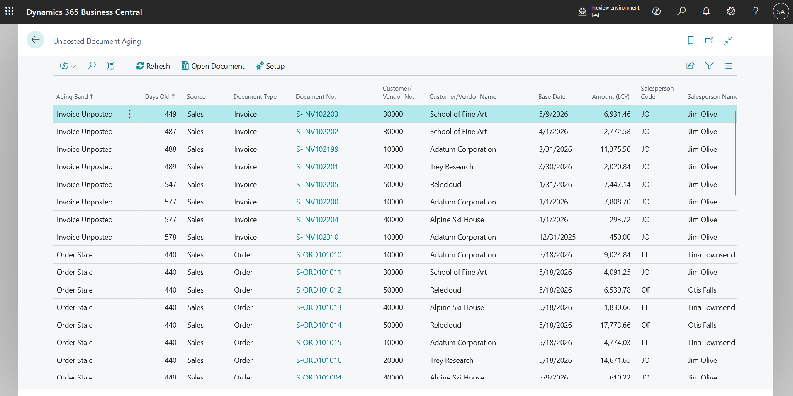

# Unposted Document Aging

Business Central lets you filter the sales order list by date, but you cannot see quotes, orders and unposted invoices **together**, aged into bands, grouped by who owns them. So stale documents pile up: quotes nobody chased, orders shipped but never invoiced, invoices sitting unposted since last month. This extension gives you one page that answers "what is stale and whose is it", plus an optional emailed digest so each salesperson gets only their own rows.



## Install

1. Clone the repo and open it in VS Code with the AL Language extension.
2. Run **AL: Download Symbols**.
3. Press <kbd>F5</kbd> to publish to your sandbox, or build with <kbd>Ctrl</kbd>+<kbd>Shift</kbd>+<kbd>B</kbd> and upload the `.app`.
4. Assign the **Unposted Doc Aging** permission set.
5. Search for **Unposted Document Aging**.

The extension seeds its setup record on install, so the page works immediately with no configuration.

## How aging is calculated

Documents are only considered once they are older than the threshold for their type (defaults: quotes 30 days, orders 14 days, unposted invoices 7 days). Filtering happens in SQL, not in AL loops, so the page stays usable on large databases.

Each row lands in one band:

| Band | Rule |
| --- | --- |
| Shipped Not Invoiced | Order that is completely shipped, or has any line with a shipped quantity |
| Quote Expired | Quote whose *Quote Valid To Date* is in the past |
| Invoice Unposted | Unposted invoice older than the invoice threshold |
| Order Stale | Order older than the order threshold with nothing shipped |
| Quote Stale | Quote older than the quote threshold and not expired |
| Other | Fallback |

Bands sort in that order, so the money is at the top. *Shipped Not Invoiced* and *Quote Expired* are highlighted.

**Age By** decides which date the age is measured from:

- **Document Date** (default) is what users mean when they say "old". It is also backdated regularly, which is why some people will not trust it.
- **Created** uses the record's `SystemCreatedAt` and tells you when the document genuinely appeared.

Amounts are the document total including VAT, converted to LCY, calculated only for rows that reach the list. Turn **Calculate Amounts** off on very large databases if the page feels slow. Purchase documents are off by default; switch on **Include Purchase Documents** to include them.

Choose a document number to open the underlying document.

## Digest setup

1. Open **Unposted Aging Setup** and switch on **Digest Enabled**.
2. On the **Email Accounts** page, assign an account to the *Unposted Document Aging Digest* scenario.
3. Leave **Send Per-Salesperson Digests** on so everyone with stale documents gets their own rows, and add managers or shared mailboxes under **Digest Recipients** (optionally filtered by salesperson).
4. Choose **Create Job Queue Entry** to create a weekday-morning recurring job, then set its status to Ready.

Use **Send Digest Now** to test. A bad address on one recipient does not stop the rest; failures are listed in **Last Digest Errors**.

## Project structure

```
src/
├── Codeunits/       aging buffer builder, digest, install
├── EnumExtensions/  email scenario
├── Enums/           aging band, date basis, document source
├── Pages/           aging list, setup card, digest recipients
├── PermissionSets/  Unposted Doc Aging
└── Tables/          aging buffer (temporary), setup, digest recipients
```

## Notes

- The list is a temporary buffer built on demand, so nothing is stored and nothing goes stale. Use **Refresh** to rebuild.
- Object range 50200-50249, targeting Business Central 26.0 and later.

## License

MIT. See [LICENSE](LICENSE).
